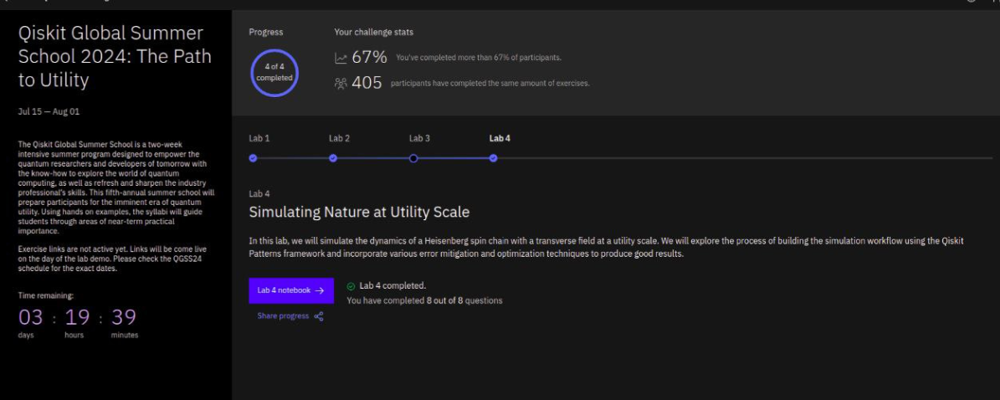

# Qiskit Global Summer School 2024: The Path to Utility

The Qiskit Global Summer School is a two-week intensive summer program designed to empower the quantum researchers and developers of tomorrow with the know-how to explore the world of quantum computing, as well as refresh and sharpen the industry professional’s skills. This fifth-annual summer school will prepare participants for the imminent era of quantum utility. Using hands on examples, the syllabi will guide students through areas of near-term practical importance.

&nbsp;

Register here:  https://ibm.biz/QGSS24_Blog

https://www.credly.com/badges/1d93a926-10a3-4213-a3c1-e6221043526d/public_url

